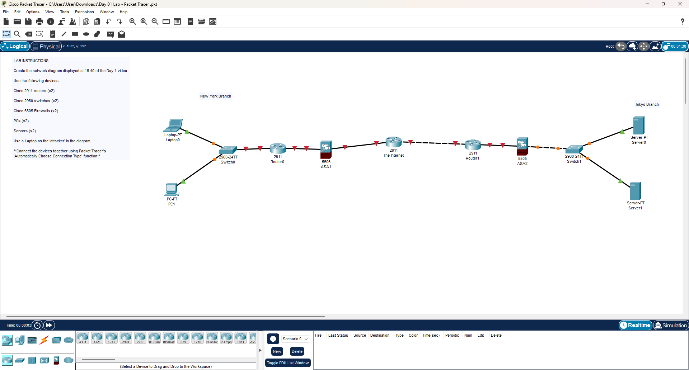

# Day 01 Lab: Basic Network Topology

##  Lab Overview
This lab establishes the physical topology for a multi-branch network simulation connecting a New York Branch and a Tokyo Branch via a simulated Internet backbone.

## 📋 Lab Instructions (Requirements)
* **Objective:** Create the network diagram displayed at 16:40 of the Day 1 video.
* **Device Requirements:**
    * Cisco 2911 routers (x2)
    * Cisco 2960 switches (x2)
    * Cisco 5505 Firewalls (x2)
    * PCs (x2)
    * Servers (x2)
* **Specific Roles:** Use a Laptop as the 'attacker' in the diagram.
* **Cabling:** Connect the devices together using Packet Tracer's *'Automatically Choose Connection Type'* function.

## 🛠 Hardware & Devices Used
| Device Type | Model | Quantity | Names |
| :--- | :--- | :--- | :--- |
| **Routers** | Cisco 2911 | 3 | Router0, Router1, The Internet |
| **Switches** | Cisco 2960-24TT | 2 | Switch0, Switch1 |
| **Firewalls** | Cisco 5505 | 2 | ASA1, ASA2 |
| **End Devices** | PC / Laptop / Server | 4 | Laptop0, PC1, Server0, Server1 |

##  Topology Structure
### 1. New York Branch (Left Side)
* **End User Zone:** Contains `Laptop0` (simulated attacker) and `PC1` connected to the access switch.
* **Edge:** `Switch0` uplinks to `Router0`, passing through the `ASA1` Firewall.

### 2. The Internet (Core)
* A central router labeled **"The Internet"** (2911) acts as the WAN backbone connecting the two branches.

### 3. Tokyo Branch (Right Side)
* **Edge:** Traffic enters via `Router1` through `ASA2` Firewall.
* **Server Farm:** `Switch1` hosts `Server0` and `Server1`.
