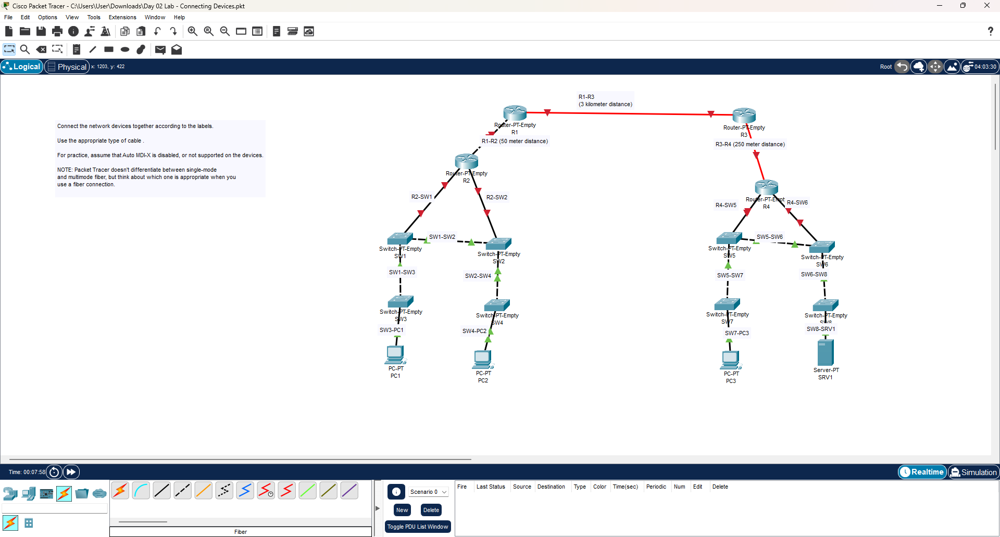

# Day 02 Lab: Connecting Devices (Media & Cabling)

##  Lab Overview
This lab focuses on **Layer 1 (Physical Connectivity)**. The objective is to connect a multi-branch network using the correct transmission media (Copper vs. Fiber) based on distance requirements and device types. 

A key constraint of this lab is that **Auto MDI-X is assumed to be disabled**, requiring the manual selection of Crossover vs. Straight-through cables.

##  Lab Instructions (Requirements)
* **Objective:** Connect the network devices together according to the labels on the diagram.
* **Cable Selection:** Use the appropriate type of cable for each link.
* **Constraint:** Assume **Auto MDI-X is disabled** (or not supported). You must manually choose the correct pinout configuration.
* **Fiber Optic Note:** Packet Tracer does not visually differentiate between Single-Mode and Multi-Mode fiber, but you must conceptually choose the correct one based on the distance labels.

##  Cabling Logic Applied
Since Auto MDI-X is disabled, the following logic was applied to the connections:

### 1. Copper Cabling Rules (Ethernet)
| Connection Type | Cable Required | Reason |
| :--- | :--- | :--- |
| **PC ↔ Switch** | Straight-Through | Unlike devices (MDI to MDI-X) |
| **Switch ↔ Router** | Straight-Through | Unlike devices |
| **Switch ↔ Switch** | Crossover | Like devices (MDI-X to MDI-X) |
| **Router ↔ Router** | Crossover | Like devices (MDI to MDI) |

### 2. Fiber Optic Selection (Distance Based)
| Link | Distance | Media Type | Reason |
| :--- | :--- | :--- | :--- |
| **R1 ↔ R3** | 3 Kilometers | **Single-Mode Fiber** | Distance exceeds Multi-Mode range (usually ~550m) and Copper limit (100m). |
| **R3 ↔ R4** | 250 Meters | **Multi-Mode Fiber** | Distance exceeds Copper limit (100m) but is suitable for Multi-Mode. |
| **R1 ↔ R2** | 50 Meters | **Copper (Crossover)** | Short enough for Ethernet; Router-to-Router requires crossover. |

##  Hardware & Devices Used
* **Routers:** PT-Empty (Modular routers requiring interface cards)
* **Switches:** PT-Empty (Modular switches)
* **End Devices:** PC-PT, Server-PT

##  Topology Structure
* **Core Backbone:** Connected via Fiber connections (R1-R3, R3-R4) due to long simulated geographic distances.
* **Left Branch:** Standard LAN distribution (R2 -> Switches -> PCs).
* **Right Branch:** Standard LAN distribution (R4 -> Switches -> PCs/Servers).
