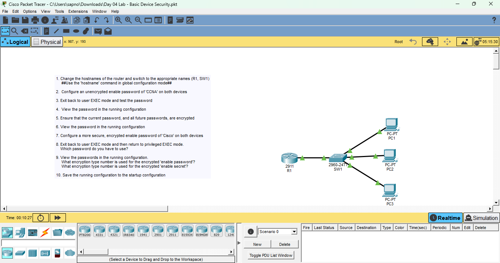

# Basic Device Security Lab – Router Configuration

## Overview
This lab demonstrates basic security configuration on a Cisco router using Cisco Packet Tracer.

The objective was to:
- Configure device hostname
- Set privileged EXEC passwords
- Enable password encryption
- Configure a secure `enable secret`
- Verify encryption types
- Save the configuration

---

## Device Used
- Cisco 2911 Router (R1)

---

## Topology



---

## Configuration Steps

### 1. Set Hostname
```bash
hostname R1
```

---

### 2. Configure Enable Password (Initial)
```bash
enable password CCNA
```

---

### 3. Enable Password Encryption
```bash
service password-encryption
```

This encrypts plain-text passwords using **Type 7 encryption**.

---

### 4. Configure Secure Enable Secret
```bash
enable secret Cisco
```

This uses **Type 5 (MD5 hash)** encryption by default.

---

### 5. Verification
```bash
show running-config
```

Example output:
```
enable password 7 <encrypted_value>
enable secret 5 <encrypted_value>
```

**Encryption Types**
- Type 7 → Reversible (weak)
- Type 5 → One-way hash (secure)


---

### 6. Save Configuration
```bash
copy running-config startup-config
```
or
```bash
write memory
```

---

## Key Learning Points
- Difference between `enable password` and `enable secret`
- Importance of password encryption
- Understanding Cisco encryption types
- Verifying configuration using CLI
- Saving configurations properly

---

## Files Included
- `Day 03 Lab - Basic Device Security.pkt`
- `topology.png`
- `show running-config.png`

---


