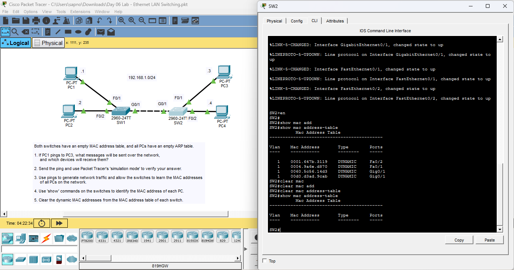

# Day 06 Lab: Ethernet LAN Switching



## 📌 Lab Overview
This lab demonstrates how switches learn MAC addresses to build their switching tables (CAM tables). It observes the difference between how a switch handles unknown unicast traffic (flooding) versus known unicast traffic (forwarding).

## 📋 Lab Instructions
1.  **Objective:** Observe the switch's MAC address table learning process.
2.  **Initial State:** Switches have empty MAC address tables; PCs have empty ARP tables.
3.  **Action:** Ping from PC1 to PC3 to generate traffic.
4.  **Verification:** Use `show mac address-table` to verify that the switch learned the source MAC addresses of the connected PCs.

## ⚙️ Commands Used
```bash
show mac address-table       ! Used to view the learned MAC addresses
clear mac address-table      ! Used to reset the table for testing
