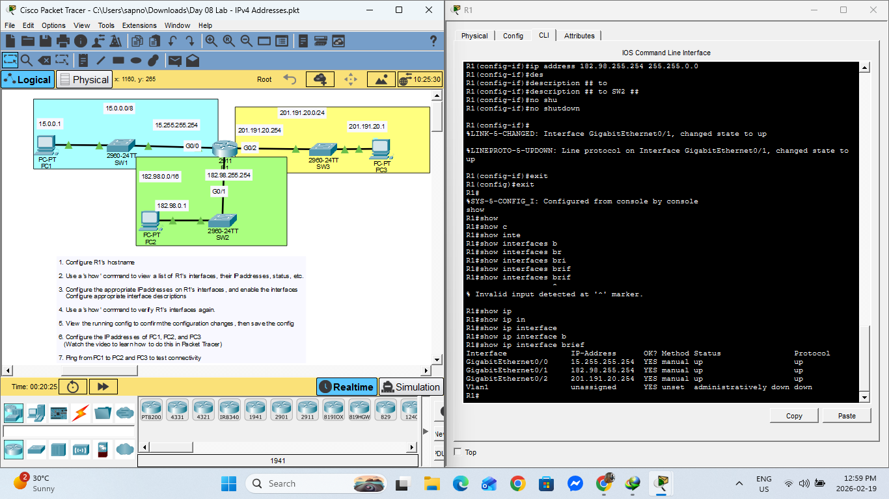

# Day 08 Lab: IPv4 Addresses



##  Lab Overview
This lab focuses on the basics of IPv4 addressing. The objective is to configure IP addresses on router interfaces to connect three separate networks (subnets) and verify connectivity between devices on those different networks based on the topology instructions.

##  Lab Tasks Completed
* Configured the hostname for Router R1.
* Configured IPv4 addresses and subnet masks on interfaces GigabitEthernet0/0, 0/1, and 0/2.
* Added descriptions to interfaces and enabled them using `no shutdown`.
* Configured IP addresses on PC1, PC2, and PC3.
* Verified interface status and connectivity using ping.

##  Key Configuration Commands Used

### Router Interface Configuration
```bash
interface GigabitEthernet0/1
 ip address 182.98.255.254 255.255.0.0
 description ## to SW2 ##
 no shutdown
