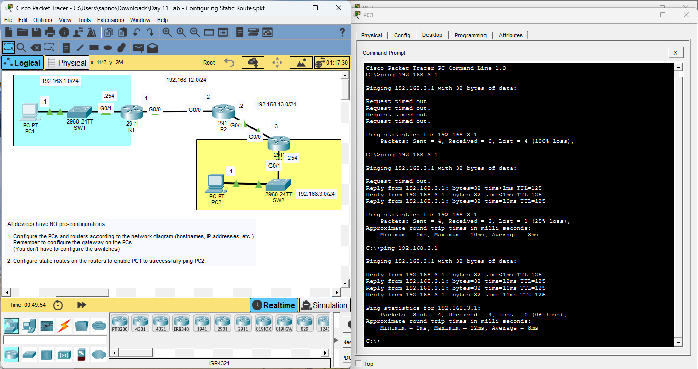

# Day 11 Lab: Configuring Static Routes



##  Lab Overview
This lab covers the configuration of static routing to enable communication between remote networks. The main objective is to route traffic successfully from PC1 to PC2 across a three-router network setup.

##  Lab Tasks Completed
* **Initial Setup:** Configured hostnames and IP addresses on all routers (R1, R2, R3) and PCs from scratch, according to the network diagram labels.
* **Default Gateways:** Assigned the correct default gateway IPs to PC1 and PC2.
* **Static Routing:** Configured static routes on R1, R2, and R3 so they know how to forward packets to non-directly connected networks.
* **Verification:** Used the Command Prompt on PC1 to ping PC2 (`192.168.3.1`), confirming that end-to-end connectivity was successfully established.

##  Key Configuration Logic
To achieve connectivity, static routes were manually added to the routers using the following command structure:
```bash
ip route [destination_network] [subnet_mask] [next_hop_ip]
