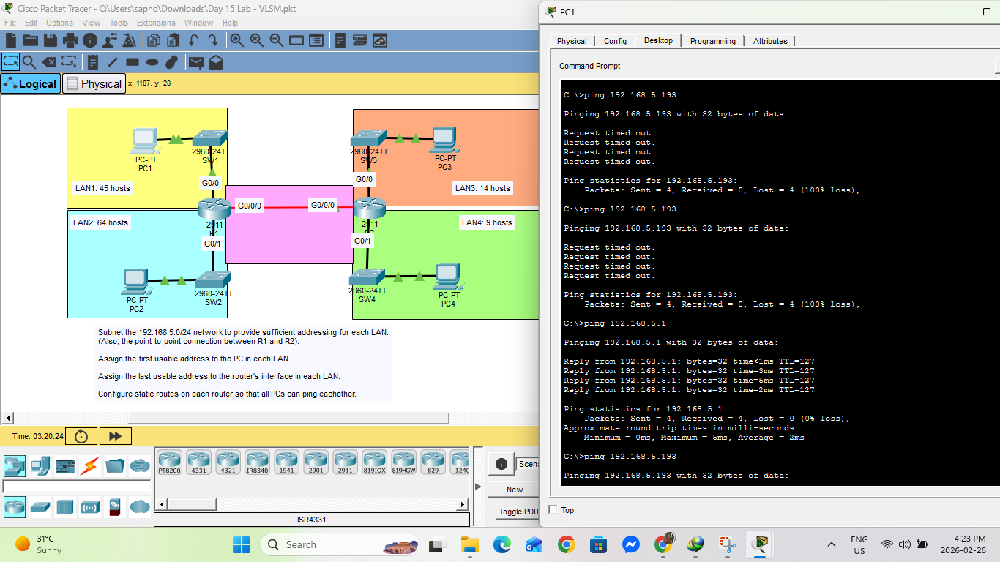

# Day 15 Lab: VLSM (Variable Length Subnet Masking)

##  Lab Overview
This lab focuses on Variable Length Subnet Masking (VLSM). The objective was to take a single major network (`192.168.5.0/24`) and efficiently divide it into multiple subnets of different sizes based on specific host requirements for four separate LANs and one point-to-point link.

##  Lab Tasks Completed
* **VLSM Calculation:** Subnetted the `192.168.5.0/24` network to accommodate the following requirements without wasting IP space:
    * LAN1: 45 hosts
    * LAN2: 64 hosts
    * LAN3: 14 hosts
    * LAN4: 9 hosts
    * Point-to-Point (R1-R2): 2 hosts
* **IP Addressing:** Assigned the first usable IP address to the PC in each LAN and the last usable IP address to the router's gateway interface in each LAN.
* **Routing:** Configured static routes on both R1 and R2 so that all networks could communicate with each other.
* **Verification:** Used the Command Prompt on the PCs to send pings and verify full end-to-end network connectivity.

##  Hardware & Devices Used
* **Routers:** 2x Cisco 2911 (R1, R2)
* **Switches:** 4x Cisco 2960-24TT (SW1, SW2, SW3, SW4)
* **End Devices:** 4x PCs (PC1, PC2, PC3, PC4)
