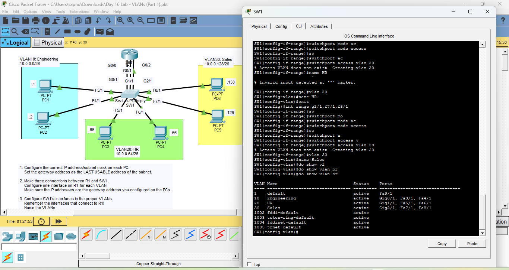

# Day 16 Lab: VLANs (Part 1)



##  Lab Overview
This lab focuses on Layer 2 network segmentation using Virtual Local Area Networks (VLANs). The objective was to divide a single physical switch into three distinct logical networks for different departments (Engineering, HR, and Sales), and configure physical router connections to act as their default gateways.

##  Lab Tasks Completed
* **IP Addressing:** Configured the correct IP addresses and `/26` subnet masks for six PCs across three different subnets.
* **Router Gateway Configuration:** Established three separate physical connections between Router R1 and Switch SW1. Configured the router interfaces with the last usable IP address of each subnet to act as the default gateways for the PCs.
* **VLAN Creation:** Created and named three VLANs on SW1:
    * VLAN 10: Engineering
    * VLAN 20: HR
    * VLAN 30: Sales
* **Port Assignment:** Assigned the correct switch interfaces (both PC-facing and Router-facing) to their respective VLANs using access mode.
* **Ping Verification:** Used the PC command prompt to ping the default gateways and other PCs to verify successful network connectivity and VLAN segmentation.
* **Table Verification:** Used the `show vlan brief` command to verify that VLANs were created successfully and ports were assigned correctly.

##  Key Configuration Commands Used

### Creating and Assigning VLANs
```bash
configure terminal
vlan 20
name HR
exit
interface range g1/1, f5/1, f6/1
switchport mode access
switchport access vlan 20
