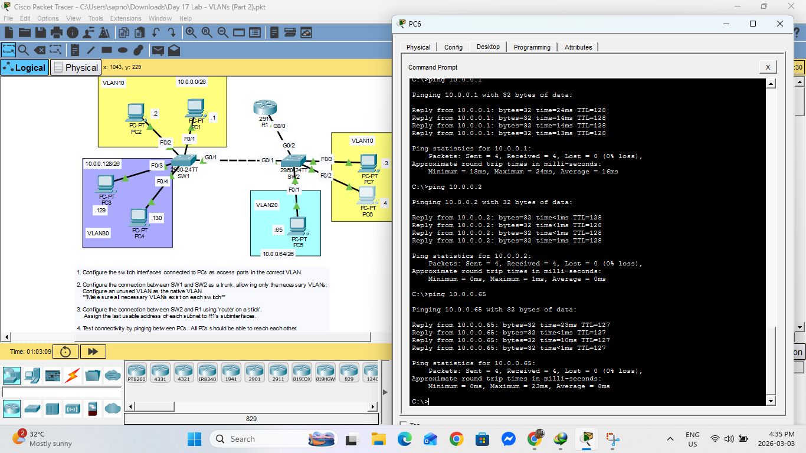

# VLAN Configuration Lab (Part 2)

## Overview
This lab demonstrates VLAN configuration, trunking, and inter-VLAN routing using a router-on-a-stick setup.

---

## Devices Used
- 2 Switches (2960)
- 1 Router (2911)
- Multiple PCs

---

## Topology

---

## Configuration Summary

- Configured access ports for VLAN 10, 20, and 30
- Configured trunk link between switches
- Allowed necessary VLANs on trunk ports
- Configured router-on-a-stick on R1
- Assigned IP addresses to each VLAN
- Verified connectivity between VLANs

---

## Verification

- Successful ping between devices in different VLANs
- Inter-VLAN routing is working correctly

---

## Files Included
- `Day 17 Lab - VLANs (Part 2).pkt`
- `topology.png`

---

