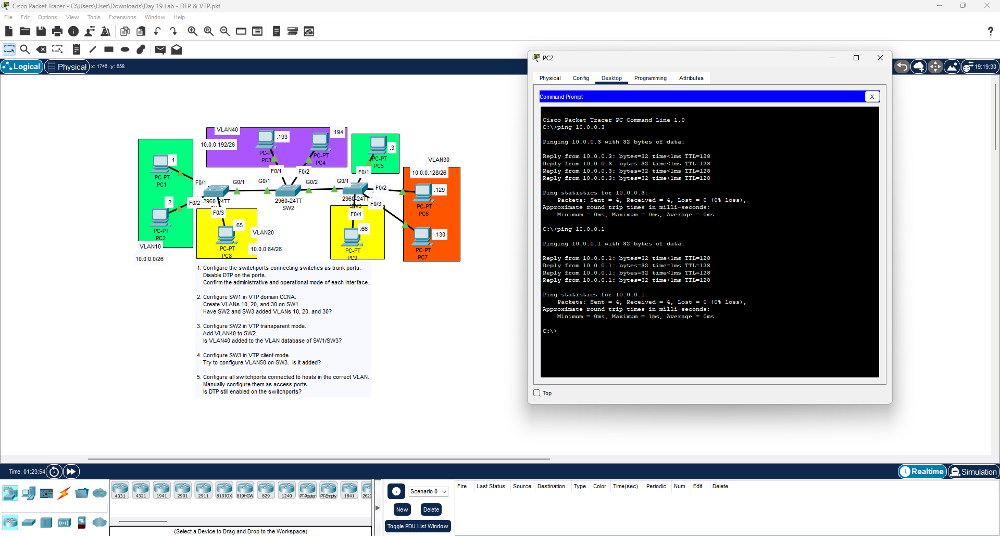

# DTP & VTP Configuration Lab

## Overview
This lab demonstrates the configuration of **Dynamic Trunking Protocol (DTP)** and **VLAN Trunking Protocol (VTP)** in a multi-switch environment.

The objective is to configure trunk links, manage VLAN propagation using VTP, and verify connectivity between devices across different VLANs.

---

## Configuration Tasks
- Configure trunk links between switches
- Disable DTP negotiation on trunk ports
- Configure **SW1 as VTP Server**
- Configure **SW2 as VTP Transparent**
- Configure **SW3 as VTP Client**
- Create VLANs (10, 20, 30, 40)
- Assign switch ports to the correct VLANs
- Verify VLAN propagation between switches

---

## Verification

Successful connectivity between VLAN hosts was verified using **ping tests**.

---

