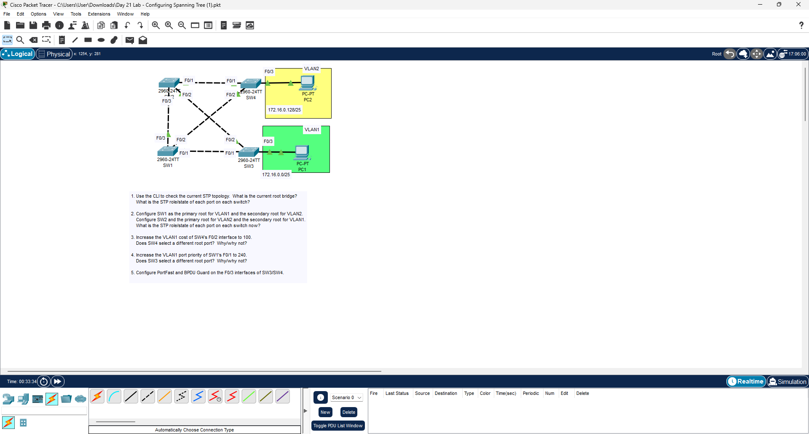

# Spanning Tree Configuration Lab

## Overview
This lab demonstrates the configuration and verification of **Spanning Tree Protocol (STP)** in a multi-switch network.

The objective is to analyze the STP topology, configure root bridges for different VLANs, modify port priorities and costs, and implement **PortFast** and **BPDU Guard** for edge ports.

---

## Network Topology

---

## Configuration Tasks
- Examine the current STP topology using CLI commands
- Identify the **root bridge**
- Configure:
  - **SW1 as primary root for VLAN1**
  - **SW2 as primary root for VLAN2**
- Adjust **port cost** to influence path selection
- Modify **port priority** for STP path changes
- Configure **PortFast** on host-facing ports
- Enable **BPDU Guard** on access ports

---

## Verification
- Verified STP root bridge election
- Confirmed correct port roles and states
- Ensured loop-free topology
- Verified end-device connectivity

---
