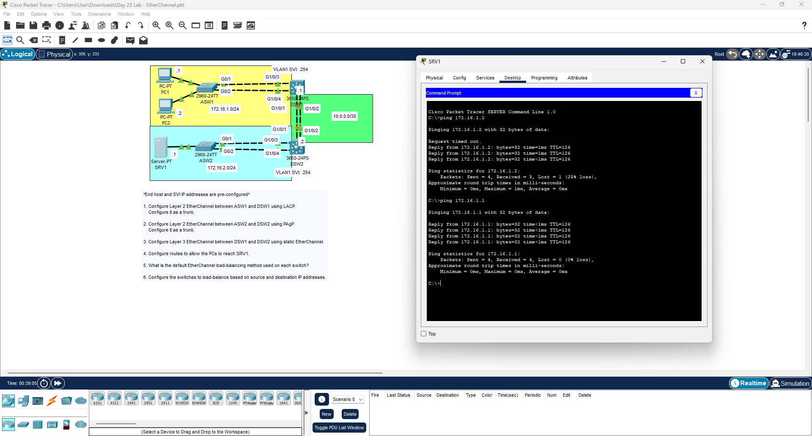

# Day 23 Lab: EtherChannel

## 📌 Lab Overview
This lab focuses on link aggregation using EtherChannel to increase bandwidth and provide redundancy. The objective was to configure different types of EtherChannels (LACP, PAgP, and Static) across Layer 2 and Layer 3 switches, and ensure end-to-end routing between separate networks.

## 📋 Lab Tasks Completed
* **LACP Configuration:** Configured a Layer 2 EtherChannel trunk using LACP between access switch ASW1 and distribution switch DSW1.
* **PAgP Configuration:** Configured a Layer 2 EtherChannel trunk using PAgP between access switch ASW2 and distribution switch DSW2.
* **Layer 3 EtherChannel:** Configured a static Layer 3 EtherChannel connection between the two distribution switches (DSW1 and DSW2).
* **Routing Setup:** Configured routes to ensure the PC network (`172.16.1.0/24`) could communicate with the Server network (`172.16.2.0/24`).
* **Load Balancing:** Changed the default EtherChannel load-balancing method on the switches to balance traffic based on source and destination IP addresses.
* **Ping Verification:** Used the Server (SRV1) terminal to successfully ping PC1 (`172.16.1.1`) and PC2 (`172.16.1.2`), proving full network connectivity.

