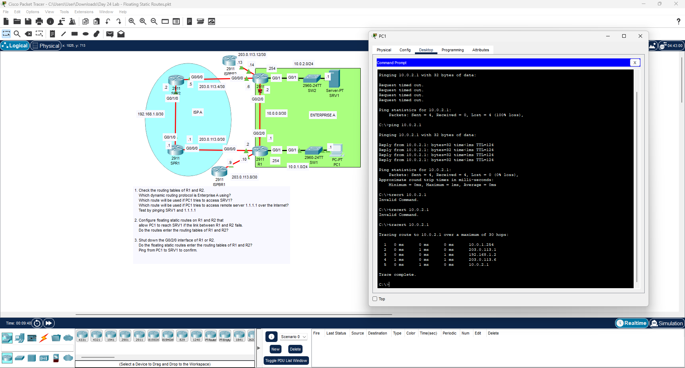

# Day 24 Lab: Floating Static Routes

##  Lab Overview
This lab demonstrates how to configure floating static routes to provide network redundancy. The objective was to create a backup path between networks that remains inactive until the primary link fails, ensuring continuous connectivity.

## 📋 Lab Tasks Completed
* **Routing Table Analysis:** Inspected the routing tables on R1 and R2 to determine the primary dynamic routing paths used by Enterprise A.
* **Floating Static Route Configuration:** Configured backup static routes on R1 and R2 with a higher Administrative Distance (AD) than the primary routing protocol so they remain out of the routing table during normal operation.
* **Failover Simulation:** Shut down the primary interface (G0/2/0) on the router to simulate a link failure.
* **Verification:** Used `ping` and `tracert` from PC1 to Server SRV1 (`10.0.2.1`). The traceroute successfully confirmed that traffic automatically failed over to the backup path through the ISP routers when the direct link was down.

## ⚙️ Key Configuration Logic
To create a floating static route, an Administrative Distance (AD) value higher than the default must be appended to a standard static route command.

