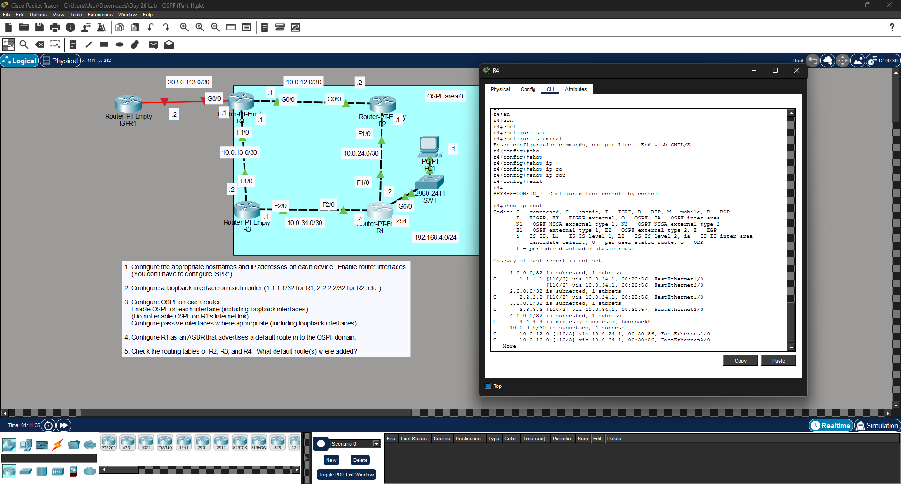

# Day 26 Lab: OSPF (Part 1)



##  Lab Overview
This lab focuses on configuring single-area Open Shortest Path First (OSPF) dynamic routing. The objective was to establish OSPF neighbor adjacencies, configure loopback interfaces for stable router IDs, and propagate a default internet route throughout the OSPF domain.

##  Lab Tasks Completed
* **Initial Setup:** Configured hostnames, IP addresses, and enabled interfaces across the enterprise routers.
* **Loopback Interfaces:** Configured loopback interfaces on each router (e.g., `1.1.1.1/32` for R1, `2.2.2.2/32` for R2) to establish stable OSPF Router IDs.
* **OSPF Configuration:** Enabled OSPF on all internal enterprise interfaces, including loopbacks, assigning them to OSPF Area 0.
* **Passive Interfaces:** Configured passive interfaces where appropriate (like the LAN connection to PC1) to prevent unnecessary OSPF traffic from being broadcast to end devices.
* **Default Route Injection:** Configured R1 as an Autonomous System Boundary Router (ASBR) to advertise a default route to the ISP down to the rest of the OSPF domain.
* **Routing Table Verification:** Checked the routing table on R4 using `show ip route` and successfully verified that it learned routes to the other routers' loopbacks and network segments via OSPF (indicated by the 'O' code).

## ⚙️ Key Configuration Commands Used

### Configuring Loopback & OSPF
```bash
interface loopback 0
ip address 4.4.4.4 255.255.255.255
exit
router ospf 1
network 10.0.34.0 0.0.0.3 area 0
network 4.4.4.4 0.0.0.0 area 0
passive-interface GigabitEthernet0/0
