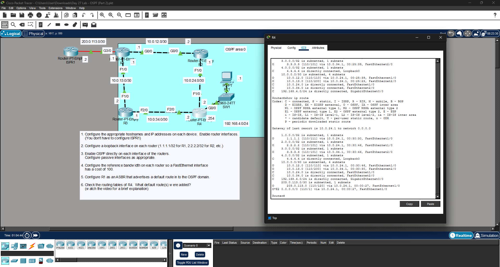

# Day 27 Lab: OSPF (Part 2)



##  Lab Overview
This lab builds upon previous OSPF configurations by introducing interface-level OSPF activation and metric tuning. The objective was to enable OSPF directly on router interfaces, adjust the reference bandwidth for accurate cost calculations, and successfully propagate a default route from an Autonomous System Boundary Router (ASBR).

##  Lab Tasks Completed
* **Initial Setup & Router IDs:** Configured hostnames, IP addresses, and enabled interfaces. Created loopback interfaces (e.g., `1.1.1.1/32` for R1) to serve as stable OSPF Router IDs.
* **Interface-Level OSPF:** Instead of using the `network` command, OSPF was enabled *directly* on each active interface across the routers.
* **Passive Interfaces:** Configured passive interfaces where appropriate to prevent OSPF hello packets from sending on end-user LANs.
* **Metric Tuning:** Adjusted the OSPF reference bandwidth on all routers so that FastEthernet interfaces accurately reflect a cost of 100.
* **Default Route Injection:** Configured R1 as an ASBR to advertise a default internet route into the OSPF area.
* **Verification:** Checked the routing table of R4 using `show ip route` and successfully verified the presence of the `O*E2 0.0.0.0/0` default route, proving the ASBR injection worked.

##  Key Configuration Commands Used

### Enabling OSPF Directly on an Interface
```bash
interface FastEthernet0/0
ip ospf 1 area 0
