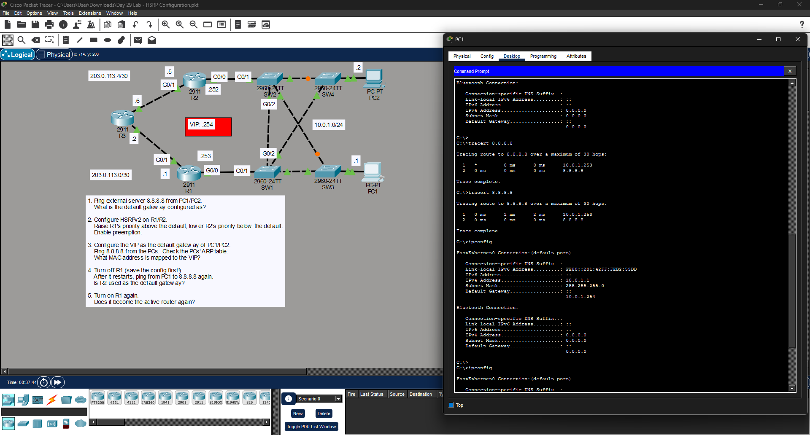

# Day 29 Lab: HSRP Configuration



##  Lab Overview
This lab covers the implementation of a First Hop Redundancy Protocol (FHRP) using Hot Standby Router Protocol (HSRP). The objective was to configure multiple routers to share a single Virtual IP (VIP) address, providing a highly available, redundant default gateway for the local network.

##  Lab Tasks Completed
* **Initial Testing:** Verified initial routing to the external server (`8.8.8.8`) before HSRP implementation.
* **HSRPv2 Configuration:** Enabled HSRP version 2 on routers R1 and R2.
* **Active/Standby Election:** Forced R1 to become the "Active" router by raising its HSRP priority above the default, and made R2 the "Standby" router by lowering its priority below the default.
* **Preemption:** Enabled HSRP preemption on R1 so it can automatically reclaim its Active status if it recovers from a failure.
* **PC Configuration:** Updated PC1 and PC2 to use the newly created Virtual IP (VIP: `10.0.1.254`) as their default gateway.
* **Failover Testing:** Simulated a router failure by turning off R1, verifying via `ping` and `tracert` that R2 seamlessly took over forwarding traffic to `8.8.8.8`. Turned R1 back on to verify successful preemption.

##  Key Configuration Commands Used

### Configuring HSRP (Example on Active Router)
```bash
interface GigabitEthernet0/0
standby version 2
standby 1 ip 10.0.1.254
standby 1 priority 110
standby 1 preempt
