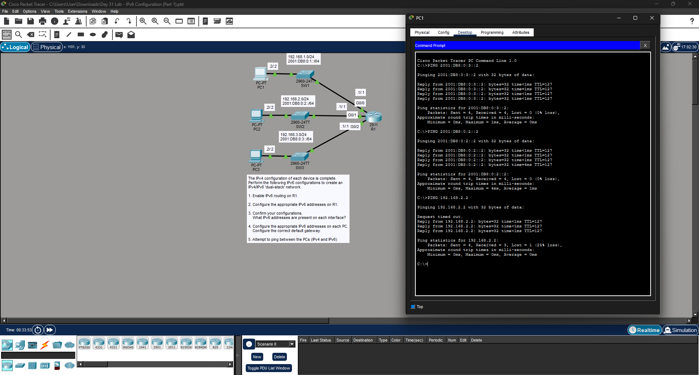

# Day 31 Lab: IPv6 Configuration (Part 1)



##  Lab Overview
This lab covers the fundamentals of configuring IPv6 alongside an existing IPv4 network, creating a "dual-stack" environment. The objective was to enable IPv6 routing, apply IPv6 addresses to router interfaces and end devices, and verify end-to-end connectivity using both protocols.

##  Lab Tasks Completed
* **IPv6 Routing:** Enabled global IPv6 routing on router R1 so it can process and forward IPv6 packets.
* **Router Interface Configuration:** Configured the appropriate IPv6 addresses and `/64` prefixes on R1's GigabitEthernet interfaces (`G0/0`, `G0/1`, `G0/2`) to act as default gateways for the three separate subnets.
* **PC Configuration:** Assigned static IPv6 addresses and the corresponding IPv6 default gateways to PC1, PC2, and PC3.
* **Dual-Stack Verification:** Used PC1's command prompt to successfully ping PC2 and PC3 using their newly configured IPv6 addresses (e.g., `2001:DB8:0:2::2` and `2001:DB8:0:3::2`). Verified that the original IPv4 network remained fully functional by pinging PC2's IPv4 address (`192.168.2.2`).

## ⚙️ Key Configuration Commands Used

### Enabling IPv6 Routing & Interface Addressing (on R1)
```bash
ipv6 unicast-routing
interface GigabitEthernet0/0
ipv6 address 2001:DB8:0:1::1/64
