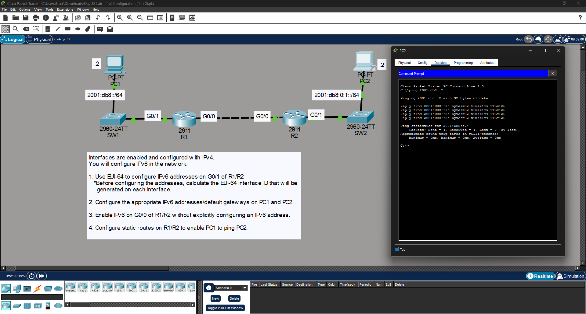

# Day 32 Lab: IPv6 Configuration (Part 2)



##  Lab Overview
This lab continues with IPv6 configuration, focusing on dynamic interface ID generation using EUI-64, enabling link-local IPv6 routing on unaddressed interfaces, and configuring IPv6 static routes for end-to-end connectivity.

##  Lab Tasks Completed
* **EUI-64 Addressing:** Configured the GigabitEthernet `G0/1` interfaces on both R1 and R2 to automatically generate their IPv6 interface IDs using the EUI-64 format based on their MAC addresses.
* **PC Configuration:** Assigned static IPv6 addresses and default gateways to PC1 (in the `2001:db8::/64` network) and PC2 (in the `2001:db8:0:1::/64` network).
* **Link-Local Enablement:** Enabled IPv6 on the point-to-point `G0/0` interfaces between R1 and R2 without assigning explicit global IPv6 addresses, relying on automatically generated link-local addresses for neighbor discovery.
* **IPv6 Static Routing:** Configured IPv6 static routes on both R1 and R2 to ensure traffic could be correctly routed between the two separate LAN segments.
* **Ping Verification:** Used the command prompt on PC2 to successfully ping PC1 (`2001:db8::2`), verifying full network connectivity across the static routes.

##  Key Configuration Commands Used

### Configuring EUI-64 Addressing
```bash
interface GigabitEthernet0/1
ipv6 address 2001:db8::/64 eui-64
