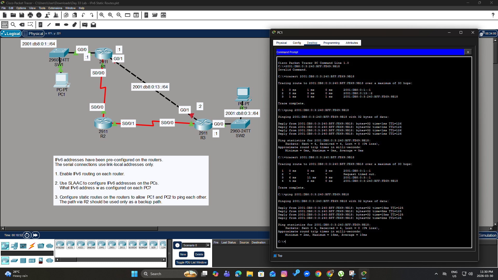

# Day 33 Lab: IPv6 Static Routes



##  Lab Overview
This lab focuses on configuring IPv6 static routing with redundancy and enabling automatic host addressing. The objective was to enable global IPv6 routing, use SLAAC for end-device addressing, and configure primary and backup (floating) static routes between remote networks.

##  Lab Tasks Completed
* **IPv6 Routing:** Enabled global IPv6 routing on all three routers (R1, R2, R3).
* **SLAAC Configuration:** Configured PC1 and PC2 to automatically generate their IPv6 addresses and default gateways using Stateless Address Autoconfiguration (SLAAC).
* **Primary Static Routes:** Configured primary IPv6 static routes on R1 and R3 over the direct Gigabit connection to allow communication between the `2001:db8:0:1::/64` and `2001:db8:0:3::/64` networks.
* **Backup (Floating) Static Routes:** Configured secondary IPv6 static routes via R2 over the Serial interfaces (using link-local addresses). Assigned a higher Administrative Distance (AD) to these routes so they only act as a backup if the direct link fails.
* **Verification:** Used `ping` and `tracert` from PC1 to PC2's SLAAC-generated address to verify end-to-end connectivity and confirm the routing path.

##  Key Configuration Commands Used


### Enabling IPv6 Routing 
```bash
ipv6 unicast-routing
```

### Configuring an IPv6 Backup (Floating) Static Route using Link-Local
```bash
ipv6 route [destination_ipv6_network]/[prefix] [exit_interface] [next_hop_link_local_address] [AD]
! Example on R1: ipv6 route 2001:db8:0:3::/64 Serial0/0/0 FE80::2 5
```

### Configuring an IPv6 Primary Static Route
```bash
ipv6 route [destination_ipv6_network]/[prefix] [next_hop_ipv6_address]
! Example on R1: ipv6 route 2001:db8:0:3::/64 2001:db8:0:13::2
```

###  Verification Commands Used (on PCs)
```bash
ping [IPv6_SLAAC_Address]
tracert [IPv6_SLAAC_Address]


