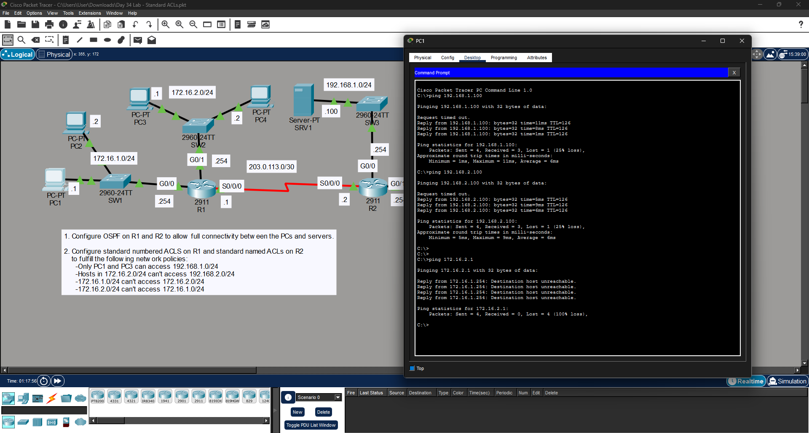

# Standard ACL Configuration Lab

## Overview
This lab demonstrates the configuration of **standard Access Control Lists (ACLs)** along with **OSPF routing** to control network traffic between different subnets.

The objective is to restrict access based on source IP while maintaining full connectivity where required.

---

---

## Configuration Tasks
- Configure **OSPF** on R1 and R2 for full connectivity
- Configure **standard numbered ACLs on R1**
- Configure **standard named ACLs on R2**
- Apply ACLs to restrict traffic based on requirements:
  - Only specific PCs can access certain networks
  - Block communication between selected subnets
- Apply ACLs to the correct interfaces and directions

---

## Verification

Connectivity was tested using **ping**:

- Allowed traffic → Successful
- Restricted traffic → Blocked (Request timed out / Destination unreachable)

---

