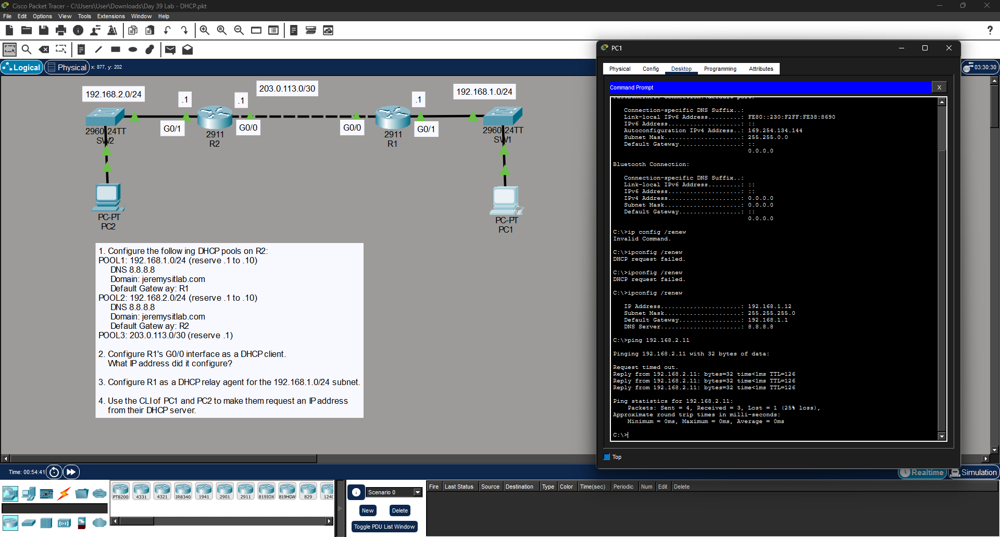

# DHCP Configuration Lab - Cisco Packet Tracer

This repository contains the configuration and topology for a DHCP lab. The goal is to configure a central router (R2) as a DHCP server, a remote router (R1) as a DHCP client and relay agent, and verify connectivity between end devices.

##  Network Topology

## 📋 Topology Overview
- **R2:** Central DHCP Server.
- **R1:** DHCP Client (WAN) and DHCP Relay Agent (LAN).
- **Subnets:**
  - **POOL1:** `192.168.1.0/24` (PC1's network)
  - **POOL2:** `192.168.2.0/24` (PC2's network)
  - **POOL3:** `203.0.113.0/30` (Point-to-Point Link)

##  Lab Objectives

### 1. Configure DHCP Pools on R2
Set up the address pools with exclusions for management/gateway addresses.
* **Excluded Addresses:** * POOL1 & POOL2: `.1` through `.10`
    * POOL3: `.1`
* **Parameters:** Include Default Gateway, DNS (`8.8.8.8`), and Domain (`jeremysitlab.com`).

### 2. Configure R1 as a DHCP Client
Configure R1's `G0/0` interface to receive an IP address automatically from R2.

### 3. Configure R1 as a DHCP Relay Agent
Enable DHCP Relay on R1's `G0/1` interface to forward requests from PC1 to the server (R2).

### 4. Client Verification
Use the PC CLI to request IP addresses and verify reachability.

---

##  Configuration Commands

### R2: DHCP Server Configuration

! Exclude static IPs from pools
ip dhcp excluded-address 192.168.1.1 192.168.1.10
ip dhcp excluded-address 192.168.2.1 192.168.2.10
ip dhcp excluded-address 203.0.113.1

! Pool for PC1 Subnet
ip dhcp pool POOL1
 network 192.168.1.0 255.255.255.0
 default-router 192.168.1.1
 dns-server 8.8.8.8
 domain-name jeremysitlab.com

! Pool for PC2 Subnet
ip dhcp pool POOL2
 network 192.168.2.0 255.255.255.0
 default-router 192.168.2.1
 dns-server 8.8.8.8
 domain-name jeremysitlab.com

! Pool for R1-R2 Link
ip dhcp pool POOL3
 network 203.0.113.0 255.255.255.252
