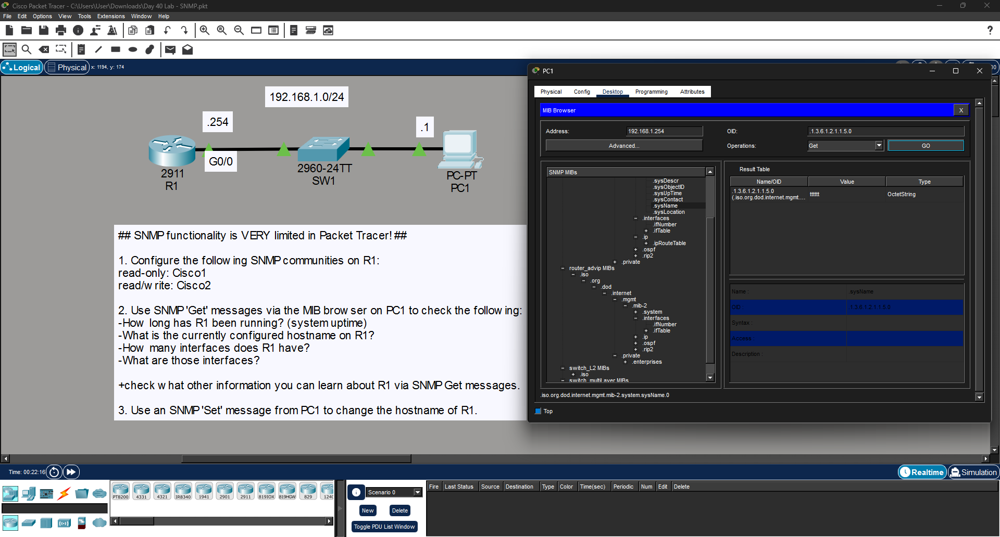

# SNMP Configuration Lab - Cisco Packet Tracer

This repository contains the configuration and lab instructions for basic SNMP implementation in Cisco Packet Tracer. The lab covers setting up community strings and using a MIB Browser to interact with a network device.

##  Network Topology

## 📋 Topology Overview
- **R1 (Router 2911):** The SNMP Agent to be managed.
- **PC1:** The SNMP Manager running a MIB Browser.
- **Subnet:** `192.168.1.0/24`
- **R1 G0/0 IP:** `192.168.1.254`
- **PC1 IP:** `192.168.1.1`

##  Lab Objectives

### 1. Configure SNMP Community Strings
Configure R1 with the following community strings to control access:
* **Read-Only (RO):** `Cisco1`
* **Read-Write (RW):** `Cisco2`

### 2. Information Gathering (SNMP Get)
Using the **MIB Browser** on PC1, perform "Get" operations to retrieve:
* **System Uptime:** How long the router has been running.
* **Hostname:** The current name configured on R1.
* **Interface Count:** Total number of interfaces on R1.
* **Interface Details:** Identification of specific interfaces.

### 3. Modify Configuration (SNMP Set)
Perform an SNMP "Set" operation from PC1 to remotely change the hostname of R1.

---

## 🛠️ Configuration Commands

### R1: SNMP Agent Setup

! Enter configuration mode
configure terminal

! Configure the Read-Only community string
snmp-server community Cisco1 RO

! Configure the Read-Write community string
snmp-server community Cisco2 RW

! Optional: Provide location and contact info
snmp-server location Lab_Rack_1
snmp-server contact Admin_Name
